# machine-learning
This repository contains projects related to machine learning csce 633.

## Linear Regression
The objective is to predict combat points using specific attributes associated with each Pokemon, including stamina, attack value, defense value, capture rate, flee rate, and spawn chance.

### Dataset
The dataset contains:
- Rows representing individual Pokemon samples.
- Columns with Pokemon names, attributes (columns 2-7), and the combat point outcome (column 8).

#### Data Exploration
- Conducted exploratory data analysis.
- Plotted 2-D scatter plots.
- Computed Pearson’s correlation coefficient between features and combat points to identify the most predictive attributes.
- The most predictive feature of Combat Points is 'attack_value' since it has maximum correlation coefficient=0.908 with 'combat_point' followed by 'defense_value'.
  

#### Feature Correlation
- Explored feature-to-feature relationships.
- Plotted 2-D scatter plots.
- Computed Pearson's correlation coefficient between features to identify correlated attributes.

|   | Feature1        | Feature2       | corr_coeff |
|---|-----------------|----------------|------------|
| 0 | stamina         | attack_value   | 0.302995   |
| 1 | stamina         | defense_value  | 0.302663   |
| 2 | stamina         | capture_rate   | -0.446850  |
| 3 | stamina         | flee_rate      | -0.271048  |
| 4 | stamina         | spawn_chance   | -0.276420  |
| 5 | attack_value    | defense_value  | 0.736777   |
| 6 | attack_value    | capture_rate   | -0.690573  |
| 7 | attack_value    | flee_rate      | -0.369064  |
| 8 | attack_value    | spawn_chance   | -0.432648  |
| 9 | defense_value   | capture_rate   | -0.697266  |
| 10| defense_value   | flee_rate      | -0.423860  |
| 11| defense_value   | spawn_chance   | -0.432499  |
| 12| capture_rate    | flee_rate      | 0.440512   |
| 13| capture_rate    | spawn_chance   | 0.472793   |
| 14| flee_rate       | spawn_chance   | 0.293222   |

#### Linear Regression Implementation
- Implemented linear regression using ordinary least squares (OLS).
- Split the data into 5 folds for cross-validation.
- Computed the square root of the residual sum of squares error (RSS) for each fold and averaged across all folds.

#### Feature Combination Experimentation
- Experimented with different feature combinations based on findings from data exploration and feature correlation.
- Reported results for each combination tested.
- Since the dataset is small, it is possible to train and test for every feature combinations. The best combination of features is picked based on minimum average value of square root of RSS. The three features finally selected are stamina, attack_value and defense_value which give the minimum average value of square root of `RSS = 764.4150`.

#### Mathematical Derivation
- Detailed the mathematical derivation for implementing and training the linear regression model with OLS solution.

## Logistic Regression
In this section, the aim is to perform data preprocessing on the Hitters dataset and then apply classification algorithms, linear regression, and logistic regression as a machine learning pipeline.

### Data Preprocessing
1. **Download and Read Data**: Utilized pandas to read the CSV file and loaded the dataset.
2. **Data Overview**: Used the `head()` function to print the initial data and provided a short description.
3. **Data Dimensions**: Obtained the shape of the data (number of rows and columns).
4. **Missing Values**: Checked for missing values using `isnull()` and computed the total number of missing values with `.sum()`.
5. **Handling Missing Values**: Dropped rows with missing data using `dropna()` function.
6. **Feature and Label Extraction**: Extracted features and the label ('NewLeague').
7. **One-Hot Encoding for Categorical Features**: Separated numerical and non-numerical columns, applied one-hot encoding to categorical features, and concatenated the transformed data.
8. **Transformation of Output**: Converted the output into numerical format using `.replace()` function.
* The given data is tabular where each row represents a player and columns represent features associated with each player.
* There are 322 players and 21 features including Player, AtBat, Hits, HmRun, Runs, RBI, Walks, Years, CAtBat, CHits, CHmRun, CRuns, CRBI, CWalks, League, Division, PutOuts, Assists, Errors, Salary, NewLeague.
* 4 features have string values (categorical features), others have numeric (int/float) values (numerical features).
* Out of 322 players, only 263 players have salary data.
* Values in column Player are unique.

### Models for Hitters
1. **Prediction**: Split the data into 80% training and 20% testing sets. Trained linear regression and logistic regression models.
2. **Feature Coefficients**: Extracted coefficients for each feature in both models and compared their differences or similarities.
3. **ROC Curve**: Plotted the ROC curve for both models and calculated the area under the curve (AUC) measurements.
4. **Optimal Decision Threshold**: Determined the optimal decision threshold to maximize the F1 score and explained the method used for calculation.
5. **Five-fold Cross-validation**: Applied stratified, five-fold cross-validation to repeat the prediction process and observed any changes in features across folds.
6. **AUROC Metrics**: Provided mean and 95% confidence intervals for AUROCs for each model.
7. **F1 Score Metrics**: Provided mean and 95% confidence intervals for the F1 score for each model.

* Coefficeints for features of both models are different. In linear regression, a linear relationship is considered between a feature and target value so coefficients represent the change in the target variable ('NewLeague') for a one-unit change in the corresponding feature. Whereas the coefficients in logistic regression represent the log-odds or logit of the probability of the target being in class 1 (since there are two classes here 0 and 1). Linear regression estimates continuous values while logistic regression estimates probability.
* AUC for Linear Regression: 0.9530791788856304
* AUC for Logistic Regression: 0.9648093841642229

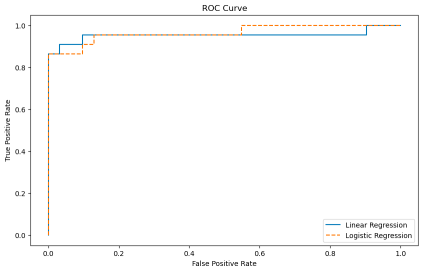

The optimal decision threshold to maximize the F1 score is the threshold value that provides the best balance between precision and recall. To determine the optimal decision threshold for maximizing the F1 score, I performed a threshold optimization process separately for logistic and linear regression models.

For the logistic regression model, I used the following steps:

1. Created an array of threshold values ranging from 0.1 to 1.0 with a step size of 0.01 (log_thresholds).
2. Initialized a variable best_f1_score_log to 0 to keep track of the best F1 score.
3. Iterated through each threshold value in log_thresholds.
4. For each threshold, I applied it to the logistic regression predictions (log_y_pred) to classify data points into two classes (0 or 1).
5. Calculated the F1 score using the true labels (y_test) and the predicted labels.
6. Compared the calculated F1 score with the current best F1 score (best_f1_score_log). If the new F1 score was higher, I updated best_f1_score_log and stored the threshold as log_optimal_threshold.

For the linear regression model, I followed a similar process:

1. Created an array of threshold values ranging from the minimum prediction value to the maximum prediction value with a step size of 0.01 (linear_thresholds).
2. Initialized a variable best_f1_score_linear to 0 to track the best F1 score for the linear regression model.
3. Iterated through each threshold value in linear_thresholds.
4. For each threshold, I applied it to the linear regression predictions (linear_y_pred) to classify data points into two classes.
5. Calculated the F1 score using the true labels (y_test) and the predicted labels.
6. Compared the calculated F1 score with the current best F1 score (best_f1_score_linear). If the new F1 score was higher, I updated best_f1_score_linear and stored the threshold as linear_optimal_threshold.
7. The log_optimal_threshold and linear_optimal_threshold values represent the decision thresholds that maximize the F1 score for the logistic and linear regression models, respectively. These thresholds are selected to achieve the best balance between precision and recall for each model's classification task.

* Optimal Threshold for Linear Model=  0.15011863724741198
* Optimal Threshold for Logistic Model=  0.16999999999999998
* The number of features remains the same across all folds. It suggests that the dataset was split consistently into folds, and each fold had the same set of features during the cross-validation process. This consistency ensures that the evaluation of models in each fold is fair and consistent.

### Mathematical Derivation
Explained the mathematical derivation used for implementing and training linear and logistic regression models.

## Regularization

In this section, the focus is on utilizing Ridge and Lasso regression techniques for regularization on the Hitters dataset.

### Data Preparation
1. **Read Hitters Dataset**: Loaded the Hitters dataset into a pandas dataframe.
2. **Data Preprocessing**: Performed preprocessing steps similar to Problem B(i) of Homework 1.

### Data Splitting
3. **Data Splitting**: Split the data into train, validation, and test sets. Created X train, X val, X test, y train, y val, and y test sets.

### Ridge Model Training
4. **Train Ridge Model**: Implemented a function `train_ridge` to train the Ridge model for multiple iterations and alpha values. Utilized the validation set for hyperparameter tuning to find the optimal alpha value that provides the best model performance.

### Lasso Model Training
5. **Train Lasso Model**: Created a function `train_lasso` to train the Lasso model for multiple iterations and alpha values. Utilized the validation set for hyperparameter tuning to find the optimal alpha value that provides the best model performance.

### Coefficients Comparison
6. **Ridge Coefficients**: Implemented a function `ridge_coefficients` to obtain the trained Ridge model and its coefficients.
7. **Lasso Coefficients**: Implemented a function `lasso_coefficients` to obtain the trained Lasso model and its coefficients. Compared coefficients between the Lasso and Ridge models.

### Model Evaluation
8. **ROC Curve - Ridge Model**: Implemented a function `ridge_area_under_curve` to calculate area under the curve (AUC) measurements for the Ridge Model. Plotted the ROC curve with appropriate labels, legend, and title.

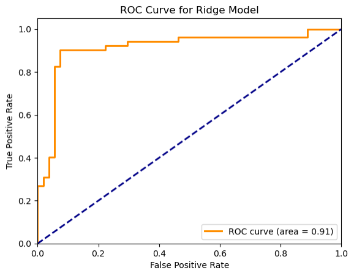

10. **ROC Curve - Lasso Model**: Implemented a function `lasso_area_under_curve` to calculate area under the curve (AUC) measurements for the Lasso Model. Plotted the ROC curve with appropriate labels, legend, and title.

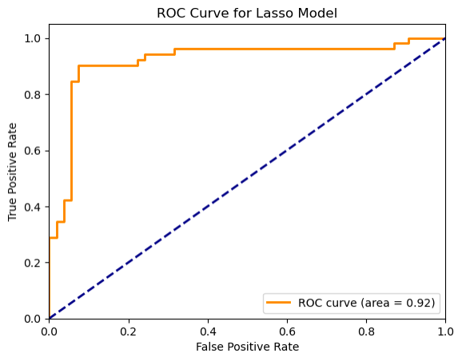

## Decision Trees

In this section, the goal is to design and code regression and classification trees using a recursive approach, demonstrating understanding of tree-based algorithms and recursion.

### Maximum-Depth Regression Tree
1. **Implementation of Regression Tree**: Developed a script to grow a maximum-depth regression tree from scratch.
   - Utilized recursion and tree-based algorithms to construct the tree.
   - Generated a tree with the specified maximum depth.

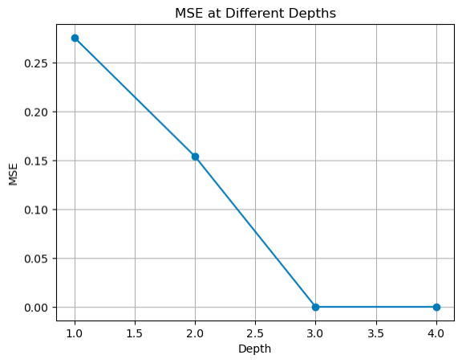

### Two-Class Classification Tree
2. **Implementation of Classification Tree**: Designed a script to grow a two-class classification tree from scratch.
   - Employed similar recursive approaches as in the regression tree to build the classification tree.
   - Constructed the tree for two-class classification.

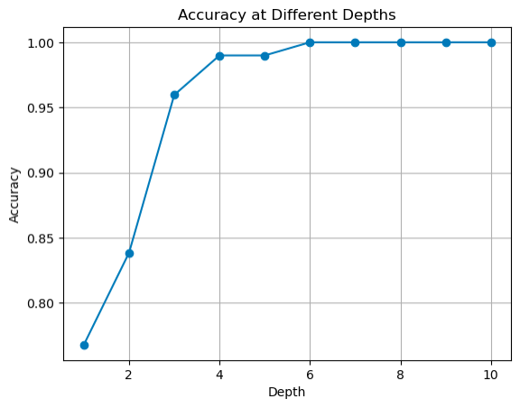

## Gradient Boosting
In this section, the aim is to utilize XGBoost, an ensemble decision-tree-based machine learning algorithm, with L2 regularization on the Hitters dataset.

### XGBoost Model Training with L2 Regularization
1. **Training XGBoost Model**: Implemented a function `train_XGB` to use XGBoost with L2 regularization for the Hitters dataset.
   - Tuned hyperparameters, including alpha values, using repeated training for optimal performance.
   - Computed AUC values with the validation set to identify the best alpha value.

### Model Training and Testing
2. **Training and Testing the Best Model**: Utilized the best parameters found in step C-i to train and test the XGBoost model on the dataset.

### Model Evaluation - ROC Curve
3. **Plotting ROC Curve**: Implemented a function to plot the ROC curve for the XGBoost model.
   - Calculated area under the curve (AUC) measurements.
   - Included axes labels, legend, and title in the plot for clarity.

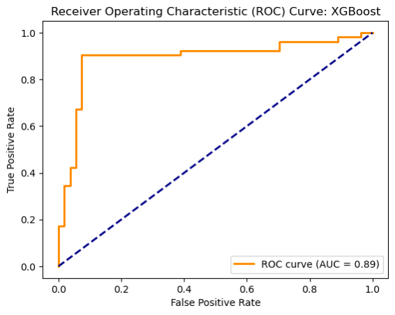

### Results Comparison
4. **Comparing XGBoost with Ridge and Lasso Models**: Compared the performance of the XGBoost model with the Ridge and Lasso models from Part A.

|Model| AUC ROC| Optimal $\alpha$|
|-----|-----|----|
|Ridge Regression|0.913|1|
|Lasso Regression|0.919|0.01|
|XGBoost with L2 regularization|0.892|0.001|
 
#### Findings:
* Both Ridge and Lasso Regression models outperform the XGBoost model with L2 regularization in terms of AUC ROC. Lasso Regression has the highest AUC ROC (0.919), followed closely by Ridge Regression (0.913). This is an indication that feature selection is a good step for the given dataset.
* Ridge and Lasso Regressions are linear regression techniques that often perform well when dealing with a moderate number of features and linear relationships. They may provide good results when the relationships between features and the target variable are approximately linear.
* The XGBoost model with L2 regularization, while a powerful ensemble method, seems to have lower predictive performance in this specific scenario compared to linear regression techniques. It's possible that the XGBoost model's complexity and regularization settings may not be well-suited for the given dataset and problem, leading to lower AUC ROC values.
* It might also be the case that AUC ROC is not the best evaluation metrics for XGBoost model.
* The optimal hyperparameters for Ridge and Lasso Regression models are significantly different from the optimal $\alpha$ value for the XGBoost model with L2 regularization. This suggests that the degree of regularization required in the Ridge and Lasso models differs from that in the XGBoost model.

## Feed Forward Neural Networks and Convolutional Neural Networks
The task involves processing images from the CIFAR-10 dataset, containing 32x32 color images categorized into 10 classes. The goal is to perform image classification using FNNs and CNNs, evaluating their performance based on different hyperparameters and techniques.

### Image Visualization
**Visualization**: Randomly selected and visualized 5-6 images from the dataset.

### Data Exploration
**Data Exploration**: Counted the number of samples per class in the training data.

### FNN Image Classification
**FNN Classification**: Utilized FNNs for image classification.
   - Experimented with different FNN hyperparameters on a validation set.
   - Monitored loss, reported classification accuracy, training time, and number of learned parameters for each FNN setup.

#### Experiment 1
For Experiment 1, a simple feedforward neural network (`model1`) is used for the CIFAR-10 dataset classification task.

#### Model Architecture:
The network architecture consists of two dense hidden layers with ReLU activation functions, aiming to capture intricate patterns within the CIFAR-10 dataset.
- **Input Layer:**
  - Shape: 32x32x1 (Grayscale images)
  - Flattened to 1024 nodes
  
- **Hidden Layers:**
  - **Dense Layer 1:**
    - Nodes: 512
    - Activation: ReLU (Rectified Linear Unit)
  - **Dense Layer 2:**
    - Nodes: 256
    - Activation: ReLU
  
- **Output Layer:**
  - Nodes: 10 (for 10 classes in CIFAR-10)
  - Activation: Softmax
  
#### Optimization:
- **Optimizer:** Adam optimizer
- **Learning Rate:** Initialized with 0.001, reduces by a factor of 0.1 if validation loss does not improve for 5 epochs
- **Loss Function:** Categorical Cross-Entropy
  
#### Training:
- **Training Duration:** Trained for 100 epochs
- **Batch Size:** 128
- **Callbacks:** Utilized callbacks for variable learning rate and model checkpointing

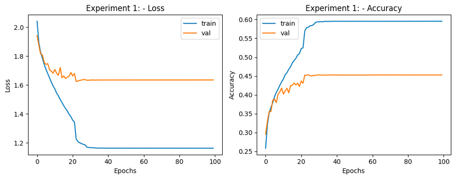

**Results for experiment 1 FNN:**
1. Final Training Accuracy: 59.55%
2. Final Validation Accuracy: 45.34%
3. Training time: 2.3 min
4. \# parameters learned: 658698

#### Experiment 2
Experiment 2 introduces an enhanced neural network architecture (`model2`) tailored for the CIFAR-10 dataset classification task, aiming to improve performance through regularization techniques and increased model complexity.

#### Model Architecture:
`model2` used increased model depth with three dense hidden layers, each incorporating ReLU activation functions, L2 regularization (with a coefficient of 0.001), and dropout layers to mitigate overfitting.

- **Input Layer:**
  - Shape: 32x32x1 (Grayscale images)
  - Flattened to 1024 nodes
  
- **Hidden Layers:**
  - **Dense Layer 1:**
    - Nodes: 512
    - Activation: ReLU
    - Regularization: L2 Regularization (Coefficient: 0.001)
    - Dropout: 10% dropout rate
  - **Dense Layer 2:**
    - Nodes: 256
    - Activation: ReLU
    - Regularization: L2 Regularization (Coefficient: 0.001)
    - Dropout: 10% dropout rate
  - **Dense Layer 3:**
    - Nodes: 128
    - Activation: ReLU
    - Regularization: L2 Regularization (Coefficient: 0.001)
    - Dropout: 10% dropout rate
  
- **Output Layer:**
  - Nodes: 10 (for CIFAR-10 classes)
  - Activation: Softmax
  
#### Optimization and Training:
- **Optimizer:** Adam optimizer
- **Learning Rate:** 0.001 initially, reduces by a factor of 0.1 if validation loss does not improve for 5 epochs
- **Loss Function:** Categorical Cross-Entropy
- **Training Duration:** 100 epochs
- **Batch Size:** 64
- **Callbacks:** Utilized variable learning rate and model checkpointing

**Results for experiment 2 FNN:**
1. Final Training Accuracy: 44.73%
2. Final Validation Accuracy: 43.89%
3. Training time: 4.24 min
4. \# parameters learned: 690314

*Validation accuracy is reduced from the first experiment. It might be the case that increasing number of layers does not do any good to the model.*

#### Experiment 3
Experiment 3 uses an extended neural network architecture (`model3`) with regularization techniques, limited to only 2 hidden layers.

#### Model Architecture:
- **Input Layer:**
  - Shape: 32x32x1 (Grayscale images)
  - Flattened to 1024 nodes
  
- **Hidden Layers:**
  - **Dense Layer 1:**
    - Nodes: 512
    - Activation: ReLU
    - Regularization: L2 Regularization (Coefficient: 0.0001)
    - Dropout: 10% dropout rate
  - **Dense Layer 2:**
    - Nodes: 512
    - Activation: ReLU
    - Regularization: L2 Regularization (Coefficient: 0.0001)
    - Dropout: 10% dropout rate
  
- **Output Layer:**
  - Nodes: 10 (for CIFAR-10 classes)
  - Activation: Softmax
  
#### Optimization and Training:
- **Optimizer:** Adam optimizer
- **Learning Rate:** 0.001 initially, reduces by a factor of 0.1 if validation loss does not improve for 5 epochs
- **Loss Function:** Categorical Cross-Entropy
- **Training Duration:** 120 epochs
- **Batch Size:** 512
- **Callbacks:** Utilized variable learning rate and model checkpointing

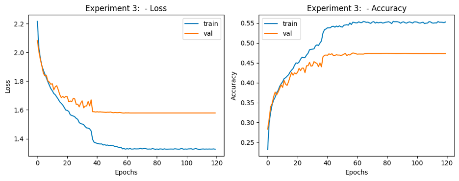

**Results for experiment 3 FNN:**
1. Final Training Accuracy: 55.41%
2. Final Validation Accuracy: 47.47%
3. Training time: 1.26 min
4. \# parameters learned: 792586

### Testing the Best Model
- Evaluated the best FNN model on the testing set, reporting classification accuracy and confusion matrix.
- **FNN test accuracy: 47.08%**

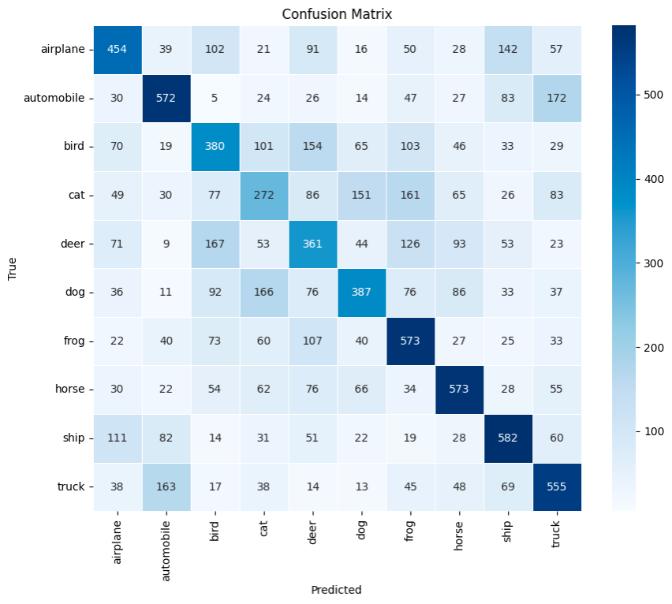

### CNN Image Classification
4. **CNN Classification**: Employed CNNs for image classification.
   - Experimented with various CNN hyperparameters on a validation set.
   - Monitored loss, reported classification accuracy, training time, and number of learned parameters for each CNN setup.

#### Experiment 1
Experiment 1 uses a Convolutional Neural Network (CNN) architecture (`model1`) tailored for the CIFAR-10 dataset classification task, leveraging convolutional and pooling layers to capture spatial hierarchies in the image data.

#### Model Architecture:
- **Input Layer:**
  - Shape: 32x32x1 (Grayscale images)
  
- **Convolutional Layers:**
  - **Conv2D Layer 1:**
    - Filters: 32
    - Kernel Size: (3x3)
    - Activation: ReLU
  - **MaxPooling2D Layer 1:**
    - Pooling: 2x2
  - **Dropout:**
    - Rate: 20%
  - **Conv2D Layer 2:**
    - Filters: 64
    - Kernel Size: (3x3)
    - Activation: ReLU
  - **MaxPooling2D Layer 2:**
    - Pooling: 2x2
  - **Dropout:**
    - Rate: 20%
  - **Conv2D Layer 3:**
    - Filters: 128
    - Kernel Size: (3x3)
    - Activation: ReLU
  - **MaxPooling2D Layer 3:**
    - Pooling: 2x2
  - **Dropout:**
    - Rate: 20%
  
- **Flattening Layer:**
  - Flatten the output to feed into Dense layers
  
- **Dense Layers:**
  - **Dense Layer 1:**
    - Nodes: 128
    - Activation: ReLU
  
- **Output Layer:**
  - Nodes: 10 (for CIFAR-10 classes)
  - Activation: Softmax
  
#### Optimization and Training:
- **Optimizer:** Adam optimizer
- **Learning Rate:** 0.0001 initially, reduces by a factor of 0.1 if validation loss does not improve for 5 epochs
- **Loss Function:** Categorical Cross-Entropy
- **Training Duration:** 100 epochs
- **Batch Size:** 64
- **Callbacks:** Utilized variable learning rate and model checkpointing

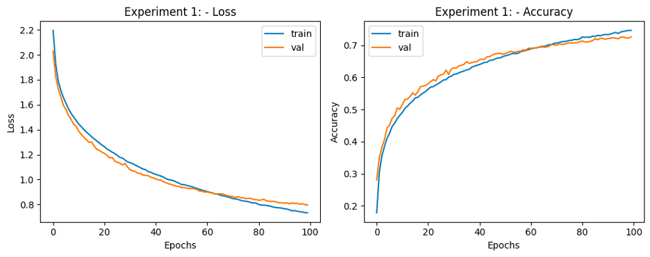

**Results for experiment 1 CNN:**
1. Final Training Accuracy: 74.63%
2. Final Validation Accuracy: 72.63%
3. Training time: 7.38 min
4. \# parameters learned: 159626

#### Experiment 2
Experiment 2 uses CNN architecture (`model2`) for the CIFAR-10 dataset classification task, featuring altered layer configurations and reduced complexity compared to Experiment 1.

#### Model Architecture:
- **Input Layer:**
  - Shape: 32x32x1 (Grayscale images)
  
- **Convolutional Layers:**
  - **Conv2D Layer 1:**
    - Filters: 64
    - Kernel Size: (3x3)
    - Activation: ReLU
  - **MaxPooling2D Layer 1:**
    - Pooling: 2x2
  - **Conv2D Layer 2:**
    - Filters: 64
    - Kernel Size: (3x3)
    - Activation: ReLU
  - **MaxPooling2D Layer 2:**
    - Pooling: 2x2
  
- **Flattening Layer:**
  - Flatten the output to feed into Dense layers
  
- **Dense Layers:**
  - **Dense Layer 1:**
    - Nodes: 128
    - Activation: ReLU
  
- **Output Layer:**
  - Nodes: 10 (for CIFAR-10 classes)
  - Activation: Softmax
  
#### Optimization and Training:
- **Optimizer:** Adam optimizer
- **Learning Rate:** 0.0001 initially, reduces by a factor of 0.1 if validation loss does not improve for 5 epochs
- **Loss Function:** Categorical Cross-Entropy
- **Training Duration:** 100 epochs
- **Batch Size:** 128
- **Callbacks:** Utilized variable learning rate and model checkpointing

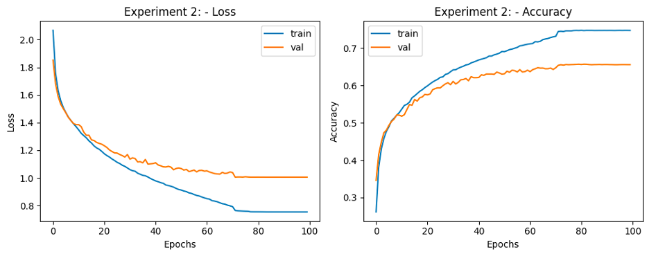

**Results for experiment 2 CNN:**
1. Final Training Accuracy: 74.79%
2. Final Validation Accuracy: 65.72%
3. Training time: 4.16 min
4. \# parameters learned: 333898

#### Experiment 3
Experiment 3 introduces an advanced Convolutional Neural Network (CNN) architecture (`model3`) designed with increased layer complexity and depth. Increased layer depth and complexity aim to enable the model to learn high-level abstractions for accurate classification.

#### Model Architecture:
- **Input Layer:**
  - Shape: 32x32x1 (Grayscale images)
  
- **Convolutional Layers:**
  - **Conv2D Layer 1:**
    - Filters: 16
    - Kernel Size: (3x3)
    - Activation: ReLU
    - Strides: (1, 1)
    - Padding: Same
  - **Conv2D Layer 2:**
    - Filters: 32
    - Kernel Size: (3x3)
    - Activation: ReLU
    - Strides: (1, 1)
    - Padding: Same
  - **Conv2D Layer 3:**
    - Filters: 64
    - Kernel Size: (3x3)
    - Activation: ReLU
    - Strides: (1, 1)
    - Padding: Same
  - **MaxPooling2D Layer 1:**
    - Pooling: 2x2
  - **Conv2D Layer 4:**
    - Filters: 16
    - Kernel Size: (3x3)
    - Activation: ReLU
    - Strides: (1, 1)
    - Padding: Same
  - **Conv2D Layer 5:**
    - Filters: 32
    - Kernel Size: (3x3)
    - Activation: ReLU
    - Strides: (1, 1)
    - Padding: Same
  - **Conv2D Layer 6:**
    - Filters: 64
    - Kernel Size: (3x3)
    - Activation: ReLU
    - Strides: (1, 1)
    - Padding: Same
  - **MaxPooling2D Layer 2:**
    - Pooling: 2x2
  
- **Flattening Layer:**
  - Flatten the output to feed into Dense layers
  
- **Dense Layers:**
  - **Dense Layer 1:**
    - Nodes: 256
    - Activation: ReLU
    - Dropout: 50%
  - **Dense Layer 2:**
    - Nodes: 128
    - Activation: ReLU
  - **Dense Layer 3:**
    - Nodes: 64
    - Activation: ReLU
  - **Dense Layer 4:**
    - Nodes: 64
    - Activation: ReLU
  
- **Output Layer:**
  - Nodes: 10 (for CIFAR-10 classes)
  - Activation: Softmax
  
#### Optimization and Training:
- **Optimizer:** Adam optimizer
- **Learning Rate:** 0.00001 initially, reduces by a factor of 0.1 if validation loss does not improve for 5 epochs
- **Loss Function:** Categorical Cross-Entropy
- **Training Duration:** 100 epochs
- **Batch Size:** 32
- **Callbacks:** Utilized variable learning rate and model checkpointing

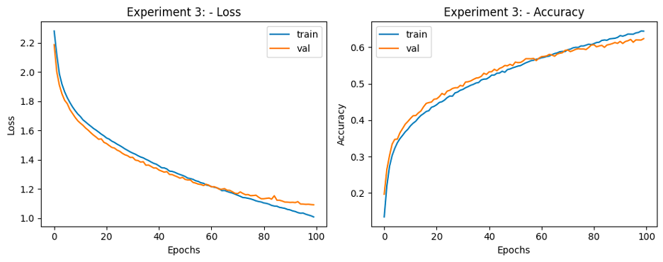

**Results for experiment 3 CNN:**
1. Final Training Accuracy: 64.45%
2. Final Validation Accuracy: 62.35%
3. Training time: 14.8 min
4. \# parameters learned: 1150458

### Testing the Best Model
- Tested the best CNN model on the testing set, comparing its accuracy with the FNN model.
- **CNN test accuracy: 72.54%**

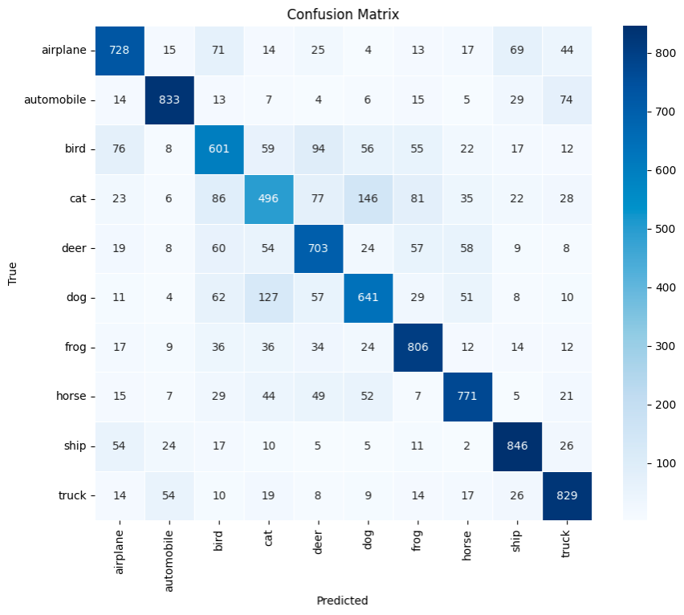

Comparison between FNN metrics and CNN metrics:

|Network|Training Accuracy|Validation Accuracy|Test Accuracy|\# Parameters|Time to train|
|-|-|-|-|-|-|
|FNN|55.41%|47.47%|47.08%|792586|1.26 min|
|CNN|74.63%|72.63%|72.54%|159626|7.38 min|

- Training, validation and test accuracies are significantly lower for FNN as compared to CNN.
- Number of parameters used in CNN is less as compared to FNN.
- Time to train CNN is higher than FNN.
- The above observations make sense because CNNs are expected to perform better than simple dense layers for image classification tasks as they can capture features in a better way.

### Bayesian Optimization
Utilized Bayesian optimization for hyperparameter tuning and reported classification accuracy on the testing set. It searches for optimal hyperparameters for the defined CNN model architecture to improve classification performance on the CIFAR-10 dataset.

### Approach:
1. **Hyperparameter Space Definition:**
   - Parameters like the number of convolutional layers, filter size, kernel size, stride size, activation functions, dropout rates, weight regularization, and learning rates are explored within specified ranges.

2. **CNN Model Creation:**
   - A function `create_cnn_model()` builds a CNN based on the provided hyperparameters.
   
3. **Objective Function for Hyperopt:**
   - The `objective()` function calculates the negative validation accuracy using cross-validation. Hyperopt minimizes this function, aiming to maximize validation accuracy.

4. **Bayesian Optimization (Hyperopt):**
   - The `fmin()` function performs Bayesian optimization with the Tree-structured Parzen Estimator (TPE) algorithm over the defined hyperparameter space.
   
5. **Output:**
   - The best set of hyperparameters discovered during the optimization process is printed at the end.

#### Model Architecture:
- The CNN architecture is composed of convolutional layers, pooling layers, dropout layers, and dense layers, specified by the hyperparameters.

#### Optimization:
- Bayesian Optimization (using TPE) iteratively explores the hyperparameter space, aiming to find the best combination that maximizes validation accuracy.

#### Output:
- The best hyperparameters are discovered through Bayesian optimization.

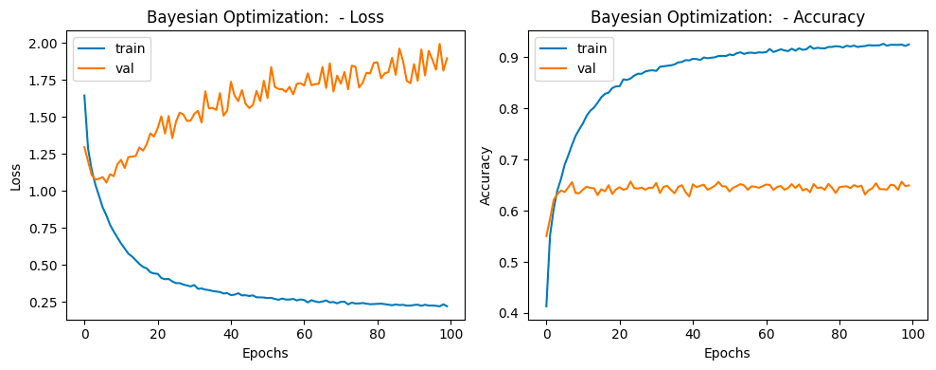

**Results for Bayesian optimization:**
1. Final Training Accuracy: 92.59%
2. Final Validation Accuracy: 65.68%
3. \# parameters learned: 629834
4. Test Accuracy: 65.24%

*The obtained accuracy is lower than that of CNN. Also, the huge difference between validation and training accuracy shows that the model is overfitting. Regularization techniques and variable learning rate used in CNN gave better results. So it seems that there is a need to redefine/increase the hyper-parameter space.*

### Fine-tuning Pre-trained CNNs
Explored fine-tuning pre-trained CNNs on CIFAR-10 data with different hyperparameters on a validation set. Reported classification accuracy on both validation and testing sets.

#### Experiment 1:
Transfer learning experiment using VGG19 as the base model for feature extraction, followed by the addition of custom fully connected layers for fine-tuning on the CIFAR-10 dataset.

#### Model Architecture:
- **Base Model (VGG19):**
  - **Pre-trained Weights:** 'imagenet'
  - **Input Shape:** (32, 32, 3)
  - **Classes:** Number of classes from the training data
  
- **Fine-tuning Layers:**
  - **Input Tensor:**
    - Shape: (32, 32, 1)
  - **Conv2D Layer:**
    - Filters: 3
    - Kernel Size: (3x3)
    - Padding: Same
  - **Transfer Learning Integration:**
    - Using the VGG19 model with weights frozen from imagenet
  - **Flattening Layer:**
    - Flatten the output for fully connected layers
  - **Fully Connected Layers:**
    - **Dense Layer 1:**
      - Nodes: 1024
      - Activation: ReLU
    - **Dense Layer 2:**
      - Nodes: 512
      - Activation: ReLU
    - **Dense Layer 3:**
      - Nodes: 256
      - Activation: ReLU
    - **Dense Layer 4:**
      - Nodes: 128
      - Activation: ReLU
    - **Output Layer (Classification):**
      - Nodes: 10 (for CIFAR-10 classes)
      - Activation: Softmax

#### Optimization and Training:
- **Optimizer:** Adam optimizer
- **Learning Rate:** 0.0001 initially, reduces by a factor of 0.1 if validation loss does not improve for 5 epochs
- **Loss Function:** Categorical Cross-Entropy
- **Training Duration:** 30 epochs
- **Batch Size:** 64
- **Callbacks:** Utilized variable learning rate

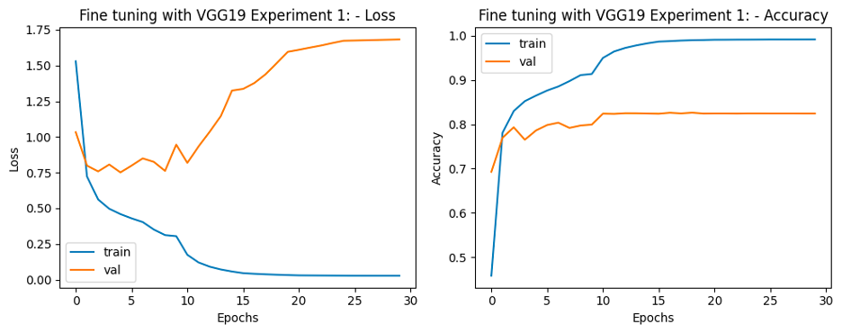

**Results for experiment 1 Fine Tuning:**
1. Final Training Accuracy: 99.15%
2. Final Validation Accuracy: 82.60%
3. \# parameters learned: 21240040

#### Experiment 2
Transfer learning experiment using VGG19 as the base model, preceded by a custom convolutional layer. The integrated model is then adapted with additional fully connected layers for fine-tuning on the CIFAR-10 dataset. The added dropout layer aims to regularize the network and prevent overfitting during training.

#### Model Architecture:
- **Custom Convolutional Layer:**
  - **Input Tensor:**
    - Shape: (32, 32, 1)
  - **Conv2D Layer:**
    - Filters: 3
    - Kernel Size: (3x3)
    - Padding: Same
  - **Transfer Learning Integration:**
    - Using the VGG19 model with weights frozen from imagenet
  - **Flattening Layer:**
    - Flatten the output for fully connected layers
  - **Fully Connected Layers:**
    - **Dense Layer 1:**
      - Nodes: 1024
      - Activation: ReLU
    - **Dropout Layer:**
      - Rate: 20%
    - **Output Layer (Classification):**
      - Nodes: 10 (for CIFAR-10 classes)
      - Activation: Softmax

#### Optimization and Training:
- **Optimizer:** Adam optimizer
- **Learning Rate:** 0.0001 initially, reduces by a factor of 0.1 if validation loss does not improve for 5 epochs
- **Loss Function:** Categorical Cross-Entropy
- **Training Duration:** 30 epochs
- **Batch Size:** 64
- **Callbacks:** Utilized variable learning rate

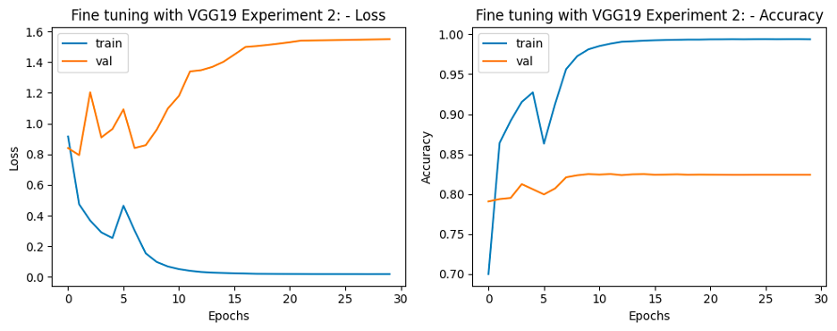

**Results for experiment 2 Fine Tuning:**
1. Final Training Accuracy: 99.38%
2. Final Validation Accuracy: 82.51%
3. \# parameters learned: 20559976

#### Experiment 3
Transfer learning experiment using VGG19 as the base model, with a custom convolutional layer preceding the integration. This model is then adapted with another fully connected layers and regularization techniques for fine-tuning on the CIFAR-10 dataset. Regularization techniques such as L2 regularization and dropout are utilized to prevent overfitting and enhance generalization.

#### Model Architecture:
- **Custom Convolutional Layer:**
  - **Input Tensor:**
    - Shape: (32, 32, 1)
  - **Conv2D Layer:**
    - Filters: 3
    - Kernel Size: (3x3)
    - Padding: Same
  - **Transfer Learning Integration:**
    - Using the VGG19 model with weights frozen from imagenet
  - **Flattening Layer:**
    - Flatten the output for fully connected layers
  - **Fully Connected Layers:**
    - **Dense Layer 1:**
      - Nodes: 256
      - Activation: ReLU
      - Regularization: L2 (0.05)
    - **Dropout Layer:**
      - Rate: 30%
    - **Output Layer (Classification):**
      - Nodes: 10 (for CIFAR-10 classes)
      - Activation: Softmax

#### Optimization and Training:
- **Optimizer:** Adam optimizer
- **Learning Rate:** 0.0001 initially, reduces by a factor of 0.1 if validation loss does not improve for 5 epochs
- **Loss Function:** Categorical Cross-Entropy
- **Training Duration:** 30 epochs
- **Batch Size:** 64
- **Callbacks:** Utilized variable learning rate

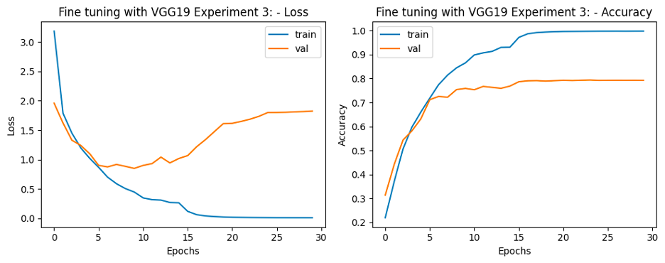

**Results for experiment 3 Fine Tuning:**
1. Final Training Accuracy: 99.75%
2. Final Validation Accuracy: 79.38%
3. \# parameters learned: 20158312

**Test accuracy: 79.38%**

## Support Vector Machines
The task involves preprocessing data, initializing SVM models with different kernels, performing feature selection, training SVM models, visualizing decision boundaries, analyzing results, and considering outlier detection using one-class SVM.

### Data Preprocessing
**Data Preprocessing**: Created a binary label based on the "Chance of Admit" column.
   - Converted values larger than the mean to 1 and 0 otherwise.

### Model Initialization
**Model Initialization**: Initialized 4 different SVM models with the following kernels:
   - SVC with linear kernel
   - LinearSVC (linear kernel)
   - SVC with RBF kernel
   - SVC with polynomial (degree 3) kernel

### Feature Selection and Model Training
**Feature Selection and Model Training**: Trained each SVM model with various feature combinations to predict admission.
   - Explored combinations such as CGPA and SOP, CGPA and GRE Score, SOP with LOR, and LOR with GRE Score.

### Result Visualization
**Result Visualization**: Visualized the decision boundary for each model and input combination.

### Result Analysis
**Result Analysis**: Analyzed the figures generated to identify the best feature + kernel combinations based on visual inspection.

Clearly from the decision boundary plots, the best feature combination is CGPA and GRE Score. For other feature combinations, the support vectors are not distributed properly across the decision boundary. It is difficult to comprehend which SVC kernel gives best result for CGPA and GRE Score just by looking at the plots as all decision boundaries look good to me. So my best guess is **SVC with polynomial (degree 3)** kernel's decision boundary for feature combination **CGPA and GRE Score** gives **best** results.

### Result Postprocessing
**Result Postprocessing**: Discussed the possibility of outliers in the data and proposed using a one-class SVM for outlier detection.

## Unsupervised Machine Learning
The goal is to conduct customer segmentation using K-Means clustering and Gaussian Mixture Models (GMMs) on credit card holder data. The data includes various customer behavior measures over a 6-month period for approximately 9000 active credit card holders.

Description of columns
1. CUST_ID: Identification of Credit Card holder
2. BALANCE: Balance amount left in their account to make purchases
3. BALANCE_FREQUENCY: How frequently the Balance is updated
4. PURCHASES: Amount of purchases made from account
5. ONEOFF_PURCHASES: Maximum purchase amount done in one-go (i.e., in a single attempt)
6. INSTALLMENTS_PURCHASES: Amount of purchase done in installment
7. CASH_ADVANCE: Cash in advance given by the user
8. PURCHASES_FREQUENCY: Frequency of purchases
9. ONEOFF_PURCHASES_FREQUENCY : Frequently of purchases happening in one-go
10. PURCHASES_INSTALLMENTS_FREQUENCY : Frequency of purchases happening in in- stallments
11. CASH_ADVANCE_FREQUENCY : Frequency of cash being paid in advance
12. CASH_ADVANCE_TRX: Number of transactions made with "Cash in Advanced"
13. PURCHASES_TRX: Number of purchase transactions being made
14. CREDIT_LIMIT: Credit card limit for the user
15. PAYMENTS: Amount of payment made by the user
16. MINIMUM_PAYMENTS: Minimum amount of payments made by the user
17. PRC_FULL_PAYMENT: Percent of full payment made by the user
18. TENURE: Tenure of credit card service for the user

* Based on percentile values of features, it may be said that CASH_ADVANCE_TRX, PURCHASES_TRX and TENURE features may not be continuous. For confirmation, we would need to prove this hypothesis.
* Looking at count of features, there are missing values in the CREDIT_LIMIT and MINIMUM_PAYMENTS columns.
* Looking at the percentiles, the distributions of some features are heavily skewed and require more detailed analysis.

### Histograms
**Histograms**: Plotted histograms for variables 2-18 in the data, providing intuitive insights into the distribution of each variable.

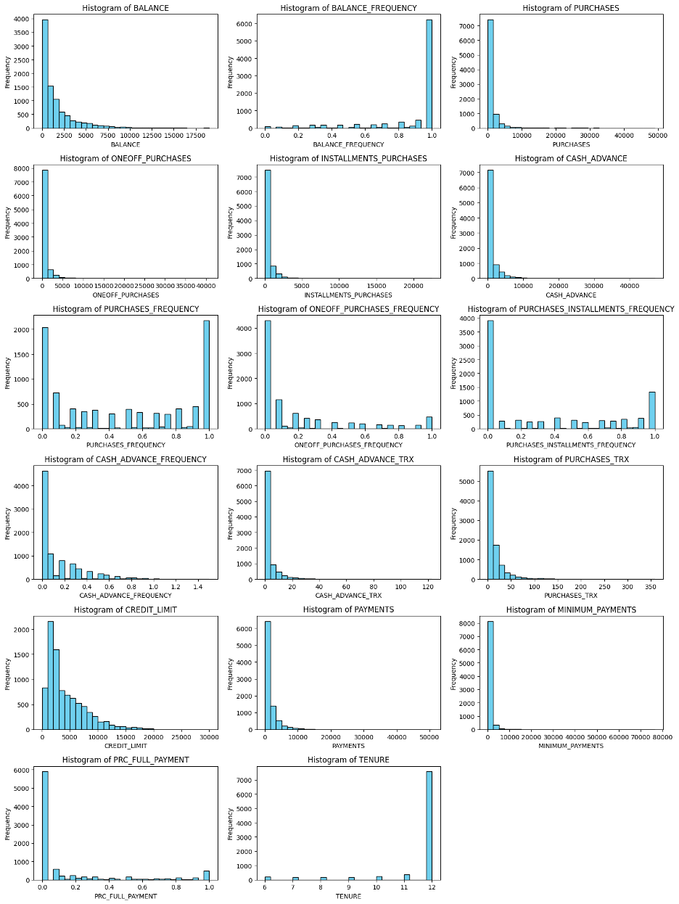

All columns except PURCHASES_FREQUENCY do not have a balanced distribution. PURCHASES_FREQUENCY does not have a normal distribution. Many other columns are also not normalized. As clear from the histograms, there is a significant skewness in many features. Conventional clustering algorithms might not be efficient enough. A more detailed examination is needed to identify outliers.

### Pearson's Correlation
**Pearson's Correlation**: Computed Pearson’s correlation between variables 2-18, visualized the correlation matrix using a heatmap, and discussed potential associations between variables.

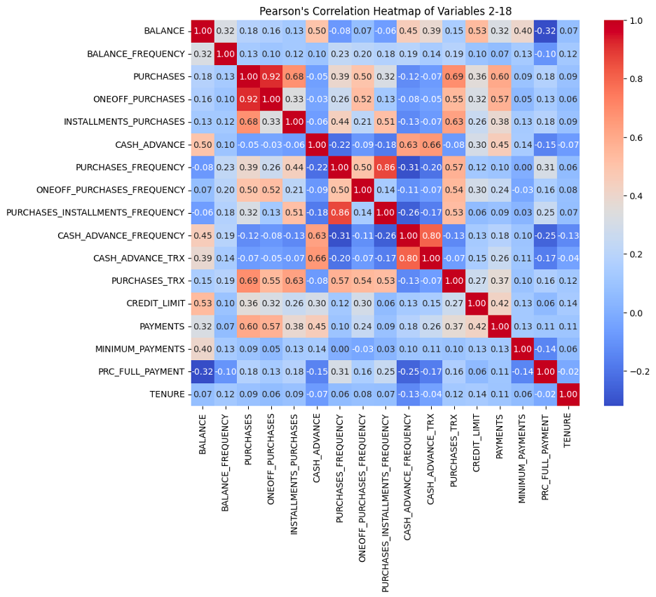

As expected by the column definitions and visible in the heatmap, there is:
* very high correlation (0.92) between PURCHASES and ONEOFF_PURCHASES.
* very high correlation (0.86) between PURCHASES_INSTALLMENTS_FREQUENCY and PURCHASES_FREQUENCY.
* very high correlation (0.80) between CASH_ADVANCE_TRX and CASH_ADVANCE_FREQUENCY.
* high correlation (0.69) between PURCHASES and PURCHASES_TRX.
* high correlation (0.68) between INSTALLMENTS_PURCHASES and PURCHASES_TRX.
* high correlation (0.63) between INSTALLMENTS_PURCHASES and PURCHASES_TRX.

Significant positive relationship with each other:
* balance to credit limit
* one-off purchases to payments
* purchases to installment purchases
* purchase to one-off purchases
* purchases frequency to purchases installments frequency
* cash advance to cash advance frequency
* cash advance to cash advance transactions
* payments to purchases
* purchase transactions to purchases
* purchase transactions to one-off purchases
* purchase transactions to installments purchases.

Medium positive relationship with each other:
* credit limit to payments
* balance to cash advance
* balance to balance frequency
* balance to cash advance frequency
* balance to cash advance transactions
* balance to payments
* balance to minimum payments
* purchases to purchases frequency
* purchases to purchases installments frequency
* purchases to credit limit

Percent of total charge paid by user has a moderate negative relationship with balance and cash advance frequency.

### K-Means Clustering
**K-Means Clustering**: Utilized K-Means clustering algorithm on variables 2-16.
   - Experimented with different numbers of clusters (K) and identified the optimal K using the elbow method.
   - Reported user assignments to each cluster, centroids, scatter, and discussed findings in relation to users’ percent of full payment and tenure of credit card service.

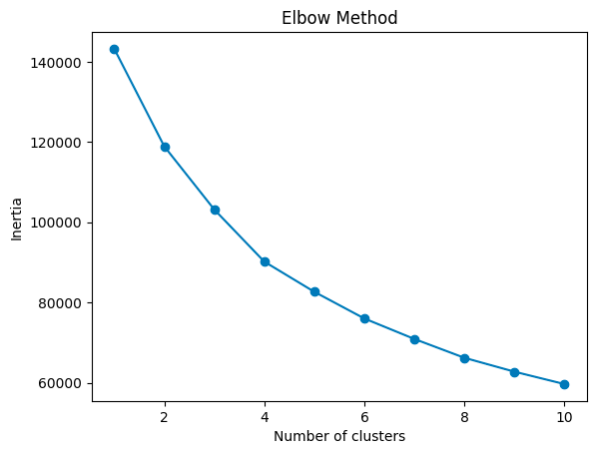

The plot shows the inertia values for different values of K. It looks like the "elbow" point is K=4 where the inertia starts decreasing more slowly. This point indicates a good balance between minimizing inertia and not having too many clusters.

### K-Means with Feature Selection
**K-Means Clustering (Feature Selection)**: Repeated K-Means clustering with a different combination of features informed by previous findings.
   - Discussed the impact of the selected features on clustering results.
### Centroid Analysis:
- **Balance and Spending Behavior:**
  - Clusters 2 and 3 have notably higher average values in BALANCE, PURCHASES, CASH_ADVANCE, and CREDIT_LIMIT compared to the other clusters, indicating higher balances and more significant transaction amounts.
  - Cluster 0 shows lower average values across these features, suggesting users with lower balances and spending patterns.
  - Cluster 4 displays moderate values, falling between the high and low spending behavior clusters.

- **Payment Behavior:**
  - Clusters 2 and 3 exhibit lower average payments compared to the other clusters.
  - Cluster 4 also demonstrates lower average payments, but higher than Clusters 2 and 3.

- **Percent of Full Payment and Tenure:**
  - **Cluster 3** stands out with a notably higher PRC_FULL_PAYMENT, indicating a higher percentage of full payments compared to other clusters.
  - **Cluster 0** shows a slightly positive PRC_FULL_PAYMENT value, albeit close to zero.
  - **Clusters 1, 2, and 4** exhibit negative PRC_FULL_PAYMENT values, indicating a lower percentage or no full payments made.

### Association with Tenure:
- Clusters 0, 1, 2, and 4 demonstrate tenure values around zero, indicating a relatively similar tenure.
- Cluster 3 shows a significantly negative tenure value, possibly suggesting newer users.

### Conclusion:
- **Payment Behavior vs. Full Payment Percentage:** The cluster with the highest PRC_FULL_PAYMENT (Cluster 3) exhibits lower average payments but a higher percentage of full payments. This might indicate a group of users who prefer to make full payments despite smaller transaction amounts.
- **Balances and Spending Patterns:** Clusters 2 and 3 with higher balances and spending patterns exhibit varied payment behaviors, indicating diverse financial behaviors within high-spending groups.
- **Tenure:** Cluster 3, despite showing higher full payment percentages, might consist of newer users.

These insights can help tailor marketing strategies or services according to different user segments. For instance, offering credit education to clusters with lower full payment percentages might be beneficial, while providing loyalty rewards or higher credit limits could engage users in clusters with higher spending patterns.

### Gaussian Mixture Models
**Gaussian Mixture Models**: Employed GMMs to cluster participants based on selected features from previous findings.
   - Reported mean vector, covariance matrix for each Gaussian, and discussed findings.
   - Computed log-likelihood of each sample belonging to the GMM and visualized the histogram of resulting log-likelihood values.

Gaussian mixture models can be used to cluster unlabeled data in much the same way as k-means.
* Gaussian mixture models can handle even very oblong clusters.
* K-means performs hard classification whereas GMM performs soft classification, i.e. in k-means, data point is deterministically assigned to one and only one cluster, but in reality there may be overlapping between the cluster GMM provide us the probabilities of the data point belonging to each of the possible clusters.
* As the name implies, a Gaussian mixture model involves the mixture (i.e. superposition) of multiple Gaussian distributions. Here rather than identifying clusters by “nearest” centroids, we fit a set of k gaussians to the data. And we estimate gaussian distribution parameters such as mean and Variance for each cluster and weight of a cluster. After learning the parameters for each data point we can calculate the probabilities of it belonging to each of the clusters.

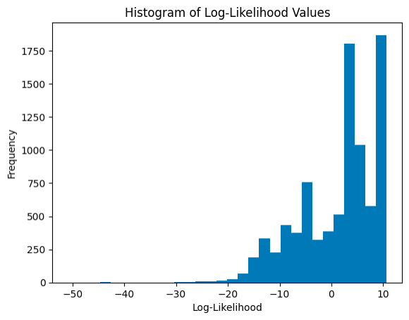

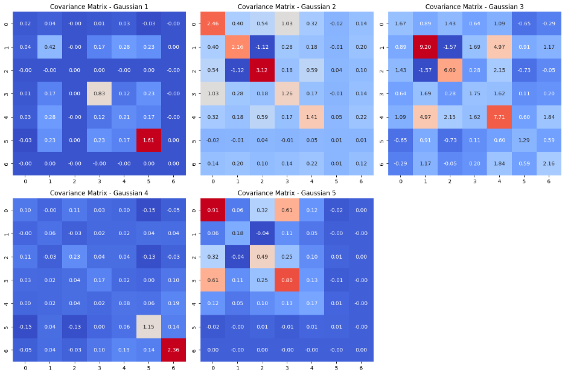

### Mean Vectors Analysis:
1. **Cluster 0 Mean Vector:**
   - **BALANCE:** -0.651
   - **PURCHASES:** 0.038
   - **CASH_ADVANCE:** -0.467
   - **CREDIT_LIMIT:** -0.059
   - **PAYMENTS:** -0.203
   - **PRC_FULL_PAYMENT:** 0.607
   - **TENURE:** 0.361
   
2. **Cluster 1 Mean Vector:**
   - **BALANCE:** 1.463
   - **PURCHASES:** 0.769
   - **CASH_ADVANCE:** 1.030
   - **CREDIT_LIMIT:** 1.224
   - **PAYMENTS:** 1.121
   - **PRC_FULL_PAYMENT:** -0.476
   - **TENURE:** 0.155
   
3. **Cluster 2 Mean Vector:**
   - **BALANCE:** 0.459
   - **PURCHASES:** 1.095
   - **CASH_ADVANCE:** 1.364
   - **CREDIT_LIMIT:** 0.993
   - **PAYMENTS:** 1.945
   - **PRC_FULL_PAYMENT:** 0.447
   - **TENURE:** -0.735
   
4. **Cluster 3 Mean Vector:**
   - **BALANCE:** -0.468
   - **PURCHASES:** -0.282
   - **CASH_ADVANCE:** -0.108
   - **CREDIT_LIMIT:** -0.643
   - **PAYMENTS:** -0.343
   - **PRC_FULL_PAYMENT:** 0.163
   - **TENURE:** -1.771
   
5. **Cluster 4 Mean Vector:**
   - **BALANCE:** 0.381
   - **PURCHASES:** -0.182
   - **CASH_ADVANCE:** 0.067
   - **CREDIT_LIMIT:** -0.042
   - **PAYMENTS:** -0.143
   - **PRC_FULL_PAYMENT:** -0.497
   - **TENURE:** 0.361

### Interpretation:
- **Mean Vectors:** They show the average values for each feature within each cluster. For instance, Cluster 2 has higher average values for most features compared to the other clusters.

#### Cluster Comparison:
- **Cluster 0:** This cluster exhibits lower to moderate values across most features, indicating users with lower balances, limited purchase and cash advance activity, while showing a higher percentage of full payments.
- **Cluster 1:** Users in this cluster demonstrate higher balances, moderate purchase and cash advance activities, and average payments, with a relatively low percentage of full payments.
- **Cluster 2:** This cluster represents users with moderate to high balances, significantly higher purchase and cash advance behavior, notably higher credit limits, and relatively high payment activities, but with a reasonable percentage of full payments.
- **Cluster 3:** Users in this cluster show low to moderate balances, minimal purchase and cash advance activity, lower credit limits, lower payment behaviors, and a slight positive percentage of full payments.
- **Cluster 4:** This cluster indicates users with moderate balances, limited purchase and cash advance behavior, lower credit limits, lower payments, and a negative percentage of full payments.

### Covariance Matrices Analysis:

#### Understanding Relationships and Variance:
- **Diagonal Values (Variance):** The higher the value, the more significant the variance within the feature. For instance, the diagonal elements represent the variance of each feature within the clusters.
- **Off-Diagonal Values (Covariance):** These values illustrate how features are related to each other within a cluster. Larger values denote a stronger relationship between variables.

### Cluster 0:
- Features within this cluster show low to moderate variances.
- The strongest correlations lie between 'PURCHASES' and 'PAYMENTS', 'PURCHASES' and 'CASH_ADVANCE', and 'PAYMENTS' and 'CASH_ADVANCE'.
- Other features have relatively weaker correlations.

### Cluster 1:
- Features exhibit a mix of moderate to high variances.
- The strongest correlations are observed between 'BALANCE' and 'PURCHASES', 'BALANCE' and 'CREDIT_LIMIT', and 'PURCHASES' and 'CREDIT_LIMIT'.
- 'CASH_ADVANCE' seems to have weak correlations with other features.

### Cluster 2:
- This cluster displays higher variances across most features.
- The strongest correlations exist between 'BALANCE' and 'PAYMENTS', 'BALANCE' and 'CREDIT_LIMIT', and 'PURCHASES' and 'CREDIT_LIMIT'.
- 'CASH_ADVANCE' again demonstrates weaker correlations with other features.

### Cluster 3:
- Features exhibit relatively lower variances.
- 'BALANCE' and 'CREDIT_LIMIT' show moderate correlations, while other features demonstrate weaker correlations within this cluster.
- 'CASH_ADVANCE' has limited relationships with other variables.

### Cluster 4:
- Features showcase lower variances overall.
- The strongest correlations appear between 'BALANCE' and 'PAYMENTS', 'BALANCE' and 'CREDIT_LIMIT', and 'PURCHASES' and 'CREDIT_LIMIT'.
- 'CASH_ADVANCE' maintains weaker relationships with other features.

### General Observations:
- For all clusters, 'BALANCE', 'PURCHASES', and 'CREDIT_LIMIT' frequently display strong correlations.
- 'CASH_ADVANCE' tends to exhibit weaker correlations with other features across clusters, indicating its relative independence within these segments.
- The diagonal elements represent variances of each feature within the clusters, with the off-diagonal elements depicting the relationships between features.

### Insights and Implications:

#### Financial Behavior Patterns:
1. **Diverse Financial Behavior:** The clusters exhibit diverse financial behaviors, ranging from responsible payment behaviors (Cluster 0) to high-spending patterns with mixed payment habits (Clusters 1, 2), and even clusters with minimal activity (Clusters 3, 4).
2. **Varying Payment Habits:** The clusters show variations in payment habits, from users who tend to make full payments (Cluster 0, slight in Cluster 3) to those with no or partial full payment behavior (Clusters 1, 2, 4).

#### Segment Characteristics:
1. **High-Spending, Varied Payment Habits:** Clusters 1 and 2 demonstrate higher spending patterns, although with different payment behaviors.
2. **Low Activity with Mixed Payment Habits:** Clusters 3 and 4 depict users with lower activity levels and diverse payment habits.

#### Business Implications:
- **Targeted Strategies:** Understanding these clusters helps in devising targeted marketing or financial strategies. For instance, Cluster 0 might respond well to loyalty programs promoting full payments, while Clusters 1 and 2 might benefit from credit limit increases or installment payment options.
- **Risk Assessment:** Clusters with lower payments (Clusters 3, 4) might pose higher credit risk, while those with varied payment habits (Clusters 1, 2) might need tailored credit management approaches.

### Log-likelihood
A skewed distribution with 2 peaks indicates that the log-likelihood values might not be following a typical normal distribution. Here's a breakdown of what these observations might indicate:

1. **Skewed Distribution:** The skewed nature suggests that the log-likelihood values are not symmetrically distributed around the mean. This could imply that the data might not fit a standard Gaussian distribution perfectly.

2. **Multiple Peaks:** Having two prominent peaks around 10 and between 4 and 5 might indicate the existence of distinct groups within the data or different levels of fit for these groups within the Gaussian mixture model. These peaks suggest that there could be clusters or subpopulations in the data that the model is capturing differently.

3. **Values at Extremes:** The presence of values ending around -30 and -42 suggests that there might be outliers or extremely low likelihoods for some samples in the dataset. These outliers could represent instances where the model has a poor fit or struggles to assign a likelihood to certain data points.

Overall, this distribution pattern provides valuable insights into how well the Gaussian mixture model captures the underlying structure of the data. It suggests potential clusters or groups and identifies outliers or instances where the model might be less accurate.

## References Used
- https://arxiv.org/pdf/2105.03404v2.pdf
- https://en.wikipedia.org/wiki/Feedforward_neural_network
- https://wikidocs.net/197813
- https://towardsdatascience.com/an-introductory-example-of-bayesian-optimization-in-python-with-hyperopt-aae40fff4ff0
- https://medium.com/@pierre.beaujuge/bayesian-optimization-on-the-head-classifier-of-pre-trained-cnns-using-the-cifar10-dataset-48c440b67b2c
- https://towardsdatascience.com/an-introductory-example-of-bayesian-optimization-in-python-with-hyperopt-aae40fff4ff0
- https://link.springer.com/article/10.1007/s10462-013-9395-x
- https://github.com/hyperopt/hyperopt
- https://www.tensorflow.org/api_docs/python/tf/image/per_image_standardization
- https://github.com/Vooban/Hyperopt-Keras-CNN-CIFAR-100
- https://stackoverflow.com/questions/76702630/error-during-training-layout-failed-invalid-argument-size-of-values-0-does-no
- https://www.sciencedirect.com/topics/engineering/confusion-matrix#:~:text=A%20confusion%20matrix%20represents%20the,by%20model%20as%20other%20class.
- https://keras.io/examples/keras_recipes/quasi_svm/
- https://www.kaggle.com/code/dansbecker/running-kaggle-kernels-with-a-gpu
- [Hitters Dataset Source](https://github.com/jcrouser/islr-python/blob/master/data/Hitters.csv)
- [Link to the Pokemon GO study](https://www.ncbi.nlm.nih.gov/pmc/articles/PMC5174727/)
- [Wikipedia - Pearson's Correlation Coefficient](https://en.wikipedia.org/wiki/Pearson_correlation_coefficient)
- https://scikit-learn.org/stable/modules/generated/sklearn.cluster.k_means.html
- https://towardsdatascience.com/gaussian-mixture-models-d13a5e915c8e
